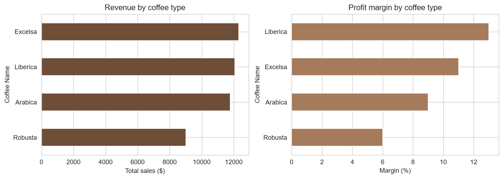
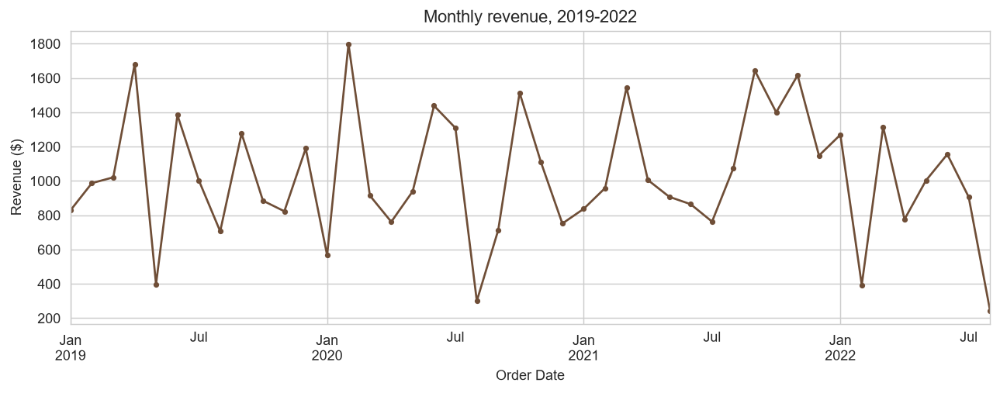
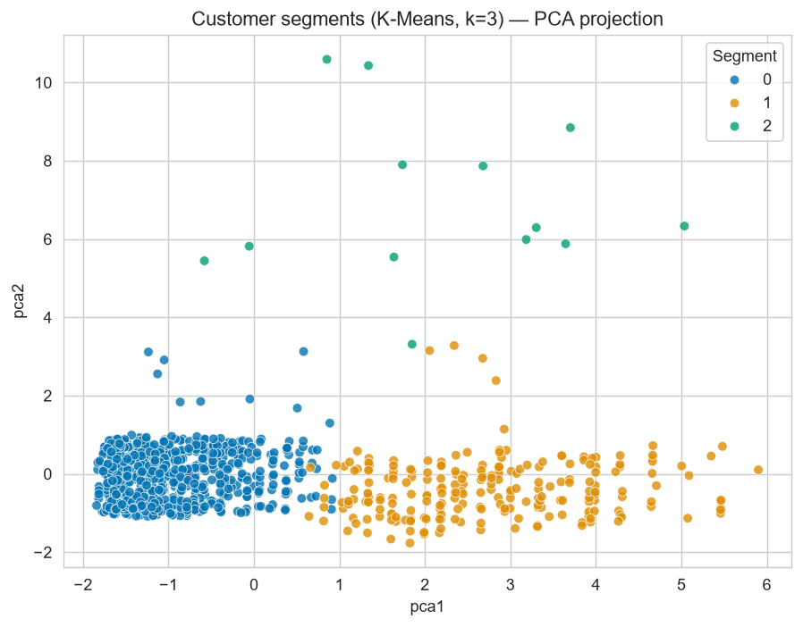
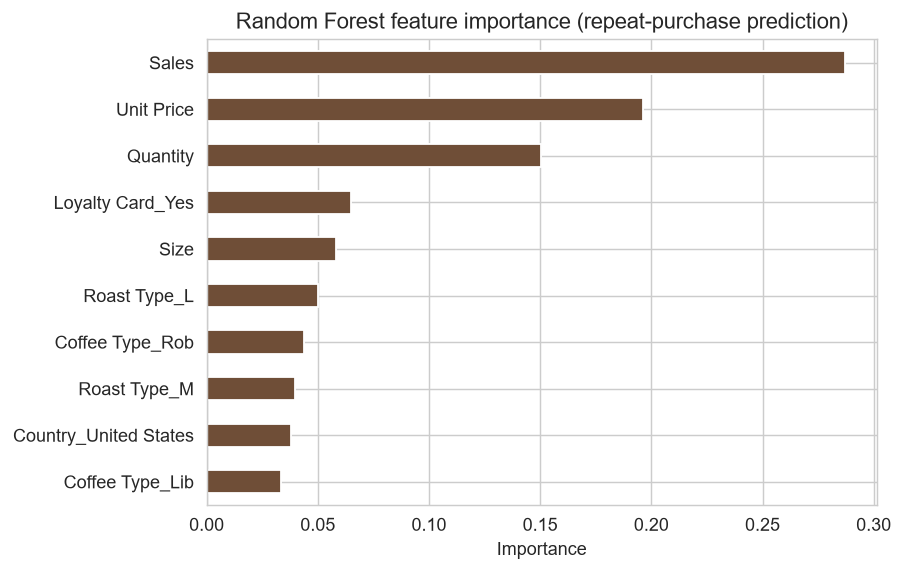
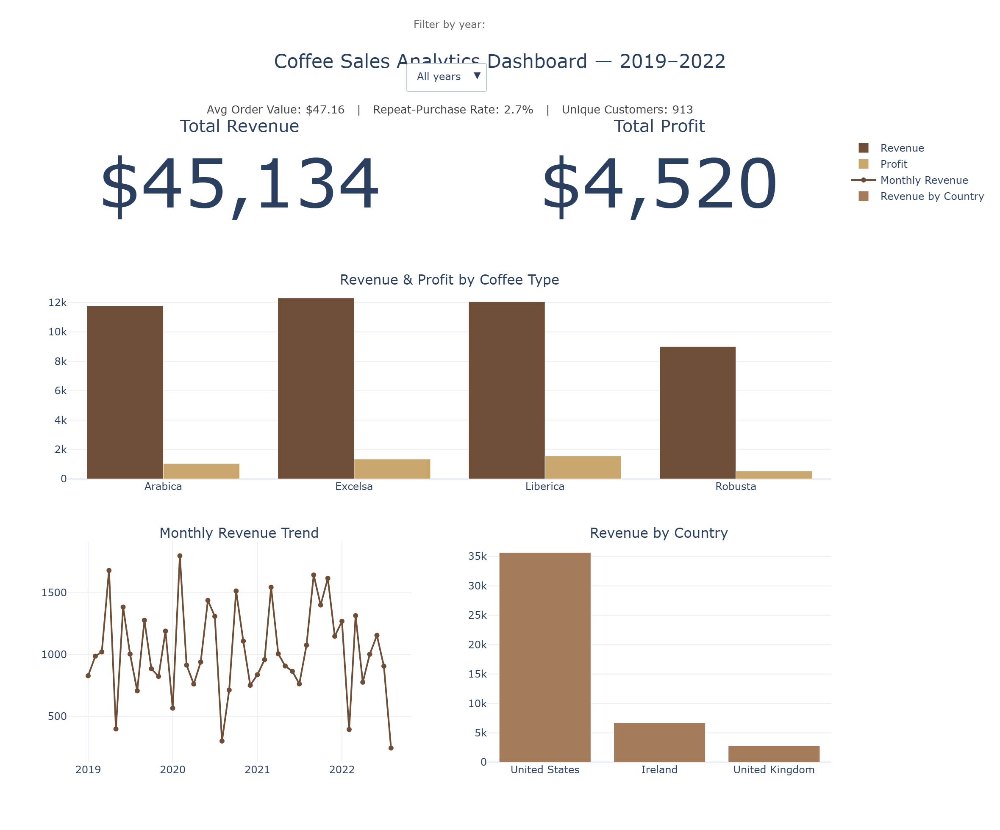

# ☕ Coffee Sales Analytics and Customer Purchase Prediction

**An end-to-end data science project — Excel → SQL → Python → Machine Learning → Interactive Dashboard**

> Full write-up: [report/Technical_Report.pdf](report/Technical_Report.pdf) · Interactive dashboard: [dashboard/coffee_sales_dashboard.html](dashboard/coffee_sales_dashboard.html)

---

## Problem

A specialty coffee roaster selling **Arabica, Excelsa, Liberica, and Robusta** beans across the **US, UK, and Ireland** has three years of order-level transactional data (2019–2022) sitting in a spreadsheet, with no pipeline connecting that raw data to validated business queries, predictive modeling, or a shareable interactive view. This project builds that pipeline end-to-end — and is explicit about where the data does, and does not, support strong predictive claims, rather than presenting only the results that look impressive.

**Research questions:**
-	Which coffee type and roast generate the highest revenue and profit?
-	Which customer characteristics, if any, predict repeat purchases?
-	Can customers be grouped into meaningful purchasing segments?
-	Does the loyalty-card program increase customer spending?
-	What seasonal and country-level patterns exist in sales?


---

## Dataset

Source: [`data/raw_data.xlsx`](data/raw_data.xlsx) — 1,000 order lines, 913 unique customers, 48 SKUs (4 coffee types × 3 roasts × 4 bag sizes), January 2019 – August 2022.

| Table | Rows | Key fields |
|---|---|---|
| `orders` | 1,000 order lines | Order ID, Date, Customer ID, Product ID, Quantity, Country, Coffee/Roast Type, Size, Unit Price, Sales, Loyalty Card |
| `customers` | 913 unique | Customer ID, Country, Loyalty Card |
| `products` | 48 SKUs | Product ID, Coffee/Roast Type, Size, Unit Price, Profit |

**Privacy note:** the raw workbook includes customer name, email, phone, and address. None of these are used in any analysis — they are dropped in [`notebooks/01_data_cleaning.ipynb`](notebooks/01_data_cleaning.ipynb) before any cleaned file is written, keeping only the de-identified Customer ID. See [`data/cleaned_data.csv`](data/cleaned_data.csv).

---

## Methods

| Layer | What it does | Files |
|---|---|---|
| **Cleaning** | Load raw workbook, validate (missing values, duplicates, referential integrity, sales reconciliation), strip PII, export analysis-ready CSVs | [`notebooks/01_data_cleaning.ipynb`](notebooks/01_data_cleaning.ipynb) |
| **SQL** | Normalized SQLite schema + validation queries + 10 business-question queries (joins, window functions, ranking, CLV) | [`sql/`](sql/) |
| **EDA** | Revenue/margin by product, country premium analysis, loyalty comparison, seasonality, correlation structure | [`notebooks/02_exploratory_analysis.ipynb`](notebooks/02_exploratory_analysis.ipynb) |
| **ML** | K-Means customer segmentation (flagship) + repeat-purchase classification (reported honestly, see below) | [`notebooks/03_machine_learning.ipynb`](notebooks/03_machine_learning.ipynb) |
| **Dashboard** | Self-contained interactive HTML dashboard (KPIs + year filter) | [`dashboard/coffee_sales_dashboard.html`](dashboard/coffee_sales_dashboard.html) |
| **Report** | Full academic-style technical report | [`report/Technical_Report.pdf`](report/Technical_Report.pdf) |

---

## Results

- Excelsa generated the highest revenue ($12,306), while Liberica had the highest profit margin (13%). 
- The 2.5 kg coffee size accounted for 52.7% of total revenue, making it the top-selling product size. 
- Only 25 out of 913 customers (2.7%) made a repeat purchase, indicating a low customer retention rate. 
- Customers enrolled in the loyalty program did not spend more than non-members. 
- Sales peaked in June and were lowest in August. The 2022 sales trend also suggests slower growth compared to 2021. 
- The United Kingdom recorded the lowest revenue and spending per customer, suggesting an opportunity to improve customer engagement. 




---

## Machine Learning

**K-Means segmentation (flagship result)** — silhouette score 0.555 at k=3, cleanly separating three segments:

| Segment | Customers | Share | Avg. spend | % repeat |
|---|---|---|---|---|
| Occasional / low-spend buyers | 671 | 73.5% | $29.75 | 1% |
| Bulk buyers | 229 | 25.1% | $98.77 | 2% |
| High-value / repeat buyers | 13 | 1.4% | $196.28 | 100% |



**Repeat-purchase classification — reported honestly.** Only 25 of 913 customers ever repeated, so a model that always predicts "no repeat" already scores **97.4% accuracy**. Logistic Regression and Random Forest (both class-weighted, features restricted to each customer's *first order only* to avoid label leakage) scored **ROC-AUC 0.51 and 0.52** — statistically indistinguishable from a coin flip. This is reported as a genuine finding about the limits of this dataset (25 positive examples is too few to learn from), not smoothed over with a misleading headline number. Full discussion in the [technical report](report/Technical_Report.pdf), Section 6.2.



---

## Dashboard
**Interactive Plotly/HTML Dashboard** Filter by year; every KPI and chart updates live.



---

## Installation

```bash
git clone https://github.com/Valerie-komen/Coffee-Sales-Analytics-ML.git
cd Coffee-Sales-Analytics-ML
pip install -r requirements.txt
```

## Reproducibility

Run in order — each step only depends on the previous one's output, all committed to this repo so any step can also be inspected without rerunning:

1. **Data cleaning:** open and run [`notebooks/01_data_cleaning.ipynb`](notebooks/01_data_cleaning.ipynb) → produces `data/cleaned_data.csv`, `data/customers_clean.csv`, `data/products_clean.csv`.
2. **SQL:** `sqlite3` (or any SQL engine) with [`sql/database_creation.sql`](sql/database_creation.sql), then run [`sql/cleaning_queries.sql`](sql/cleaning_queries.sql) and [`sql/analysis_queries.sql`](sql/analysis_queries.sql).
3. **EDA:** [`notebooks/02_exploratory_analysis.ipynb`](notebooks/02_exploratory_analysis.ipynb).
4. **ML:** [`notebooks/03_machine_learning.ipynb`](notebooks/03_machine_learning.ipynb).
5. **Dashboard:** open [`dashboard/coffee_sales_dashboard.html`](dashboard/coffee_sales_dashboard.html) directly in a browser — no server needed.

All notebook outputs (printed statistics, charts) in this repository are real, executed results — not placeholders.

---

## Repository Structure

```
Coffee-Sales-Analytics-ML/
├── README.md
├── requirements.txt
├── data/
│   ├── raw_data.xlsx
│   ├── cleaned_data.csv
│   ├── customers_clean.csv
│   ├── products_clean.csv
│   └── coffee_sales.db
├── notebooks/
│   ├── 01_data_cleaning.ipynb
│   ├── 02_exploratory_analysis.ipynb
│   └── 03_machine_learning.ipynb
├── sql/
│   ├── database_creation.sql
│   ├── cleaning_queries.sql
│   └── analysis_queries.sql
├── dashboard/
│   └── coffee_sales_dashboard.html
├── images/
│   ├── dashboard.png
│   ├── revenue_vs_margin.png
│   ├── monthly_seasonality.png
│   ├── loyalty_boxplot.png
│   ├── correlation_heatmap.png
│   ├── roast_distribution.png
│   ├── customer_segments.png
│   ├── confusion_matrix.png
│   ├── feature_importance.png
│   └── roc_curve.png
└── report/
    ├── Technical_Report.pdf
    └── Technical_Report.docx
```

---

## Limitations & Future Work

Full discussion in the [technical report](report/Technical_Report.pdf) (Sections 9–10). In short: this is a small dataset (913 customers, 25 repeat) with no demographic, marketing-touch, or macroeconomic data — real constraints on what any model trained on it can claim. Future work includes collecting behavioral signals to give repeat-purchase prediction real signal, a live-connected dashboard, sales forecasting, and CAC-vs-LTV analysis.

## Responsible AI

Direct PII is stripped before any file is committed; the dataset's geographic imbalance (79% US revenue) is disclosed as a fairness limitation; and the repeat-purchase classification result is reported at face value. Full discussion in the [technical report](report/Technical_Report.pdf), Section 11.

---

*Questions or feedback? Feel free to open an issue or connect with me on [LinkedIn](#).*
